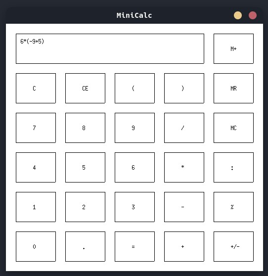

# MiniCalc



### **Table of content**
- [Description](#description)
- [Project Structure](#project-structure)
- [How to run](#how-to-run) 
- [Keyboard Shortcuts](#keyboard-shortcuts)
- [Error Handling](#error-handling)

## Description

MiniCalc is a lightweight graphical calculator developed in **C** using the **Xlib** library. It provides a basic GUI interface and supports both **mouse** and **keyboard** interaction.The project implements the following functionalities:

- Basic arithmetic operations (`+`, `-`, `*`, `/`)
- Advanced operations (`//` - integer division, `%` - modulo)
- Handling of both integers and decimal numbers
- Full parentheses support `(` and `)` for complex expressions
- Change of sign operation (`+/-`)
- Memory operations (`M+`, `MR`, `MC`) for saving and recalling values
- Error handling (e.g., division by zero, unbalanced parentheses)
- Display of error messages **inside the calculator screen**
- Smooth redraw and interaction handling

## Project Structure

```plaintext
MiniCalc/
|
|├── include/          # Header files (gui.h, logic.h)
|├── src/           # Source files (.c files: main.c, gui.c, logic.c)
|├── Makefile          # Makefile for automated compilation
|├── README.md         # Project documentation (this file)
|├── bin/              # Folder containing the built executable
└── MiniCalc          # Final executable
```

## How to Run 

You can compile the project easily by running:

```bash
make run
```

This will:

- Compile all `.c` files
- Generate the `MiniCalc` executable inside the `bin/` folder
- Run the executable (A running X server is required)

To clean the compiled files:

```bash
make clean
```

## Keyboard Shortcuts

| Key             | Function                      |
| --------------- | ----------------------------- |
| `0-9`           | Insert digits                 |
| `+ - * /`       | Arithmetic operators          |
| `.`             | Insert decimal point          |
| `(` `)`         | Insert parentheses            |
| `Enter`         | Calculate result (`=`)        |
| `Backspace`     | Delete last character (CE)    |
| `Delete`        | Clear the entire input (C)    |
| `m`             | M+ (store value in memory)    |
| `r`             | MR (recall value from memory) |
| `c`             | MC (clear memory)             |
| `q` or `Escape` | Exit the application          |

## Error Handling

- **Division by zero** → displays `"Division by zero is undefined"`
- **Unmatched parentheses** → displays `"Unmatched parentheses."`
- **Saving expressions to memory** → displays `"Cannot store expression in memory"`
- **Memory recall overflow** → displays `"Not enough space for memory value"`
- **Multiple decimal points** prevention in one number
